# Kaggle PUBG 吃鸡预测 比赛思路与总结
kaggle 比赛地址 https://www.kaggle.com/c/pubg-finish-placement-prediction 

github 代码地址 https://github.com/hyk95

- 数据分析
- 特征工程
- 模型训练
- 模型融合
  
## 1. 数据分析
在PUBG游戏中，每场比赛最多有100个玩家开始（matchId）。玩家的排名（winPlacePerc）基于在被淘汰时还有多少其他团队（groupid）还活着。

原始数据字段：

- DBNOs - Number of enemy players knocked.
- assists - Number of enemy players this player damaged that were killed by teammates.
- boosts - Number of boost items used.
- damageDealt - Total damage dealt. Note: Self inflicted damage is subtracted.
- headshotKills - Number of enemy players killed with headshots.
- heals - Number of healing items used.
- Id - Player’s Id
- killPlace - Ranking in match of number of enemy players killed.
- killPoints - Kills-based external ranking of player. (Think of this as an Elo ranking where only kills matter.) If there is a value other than -1 in rankPoints, then any 0 in killPoints should be treated as a “None”.
- killStreaks - Max number of enemy players killed in a short amount of time.
- kills - Number of enemy players killed.
- longestKill - Longest distance between player and player killed at time of death. This may be misleading, as downing a player and driving away may lead to a large longestKill stat.
- matchDuration - Duration of match in seconds.
- matchId - ID to identify match. There are no matches that are in both the training and testing set.
- matchType - String identifying the game mode that the data comes from. The standard modes are “solo”, “duo”, “squad”, “solo-fpp”, “duo-fpp”, and “squad-fpp”; other modes are from events or custom matches.
- rankPoints - Elo-like ranking of player. This ranking is inconsistent and is being deprecated in the API’s next version, so use with caution. Value of -1 takes place of “None”.
- revives - Number of times this player revived teammates.
- rideDistance - Total distance traveled in vehicles measured in meters.
- roadKills - Number of kills while in a vehicle.
- swimDistance - Total distance traveled by swimming measured in meters.
- teamKills - Number of times this player killed a teammate.
- vehicleDestroys - Number of vehicles destroyed.
- walkDistance - Total distance traveled on foot measured in meters.
- weaponsAcquired - Number of weapons picked up.
- winPoints - Win-based external ranking of player. (Think of this as an Elo ranking where - only winning matters.) If there is a value other than -1 in rankPoints, then any 0 in winPoints should be treated as a “None”.
- groupId - ID to identify a group within a match. If the same group of players plays in different matches, they will have a different groupId each time.
- numGroups - Number of groups we have data for in the match.
maxPlace - Worst placement we have data for in the match. This may not match with numGroups, as sometimes the data skips over placements.
- winPlacePerc - The target of prediction. This is a percentile winning placement, where 1 corresponds to 1st place, and 0 corresponds to last place in the match. It is calculated off of maxPlace, not numGroups, so it is possible to have missing chunks in a match.

#### 1. WinPlace 统计
最终预测值， 排名归一化到（0-1）
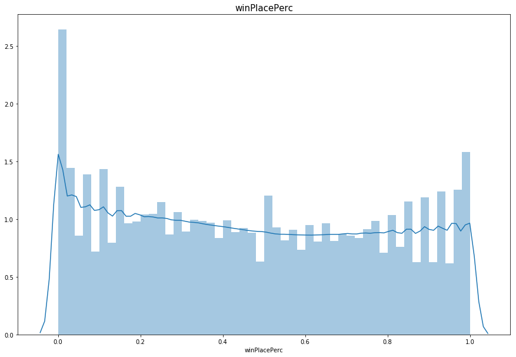

#### 2. Kill 统计
杀人数统计
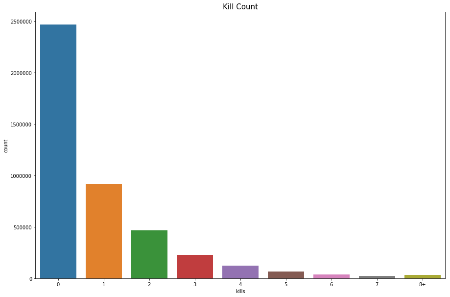

#### 3. WinPlace_Kill 统计
最终排名与杀人数统计
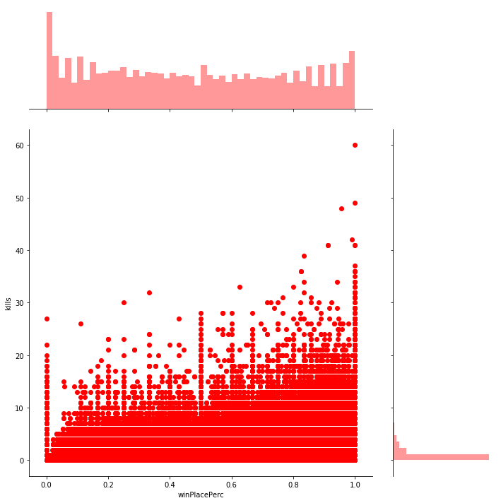
将杀人数分为(0 kills, 1-2 kills, 3-5 kills, 6-10 kills and 10+ kills)
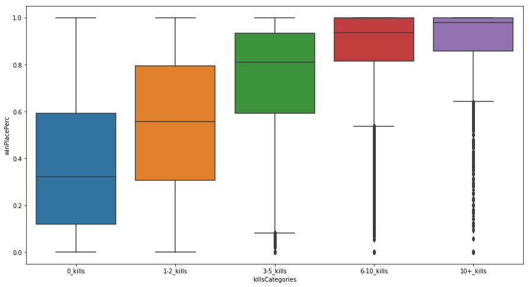

#### 3. 距离特征统计
步行距离统计
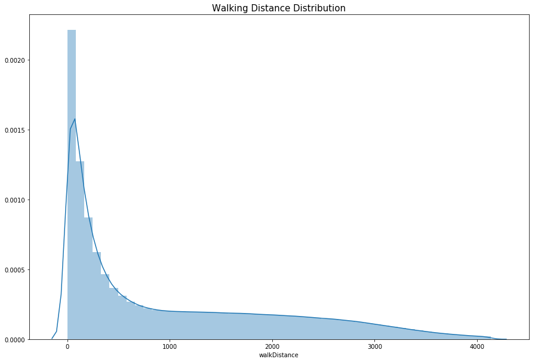
交通工具统计
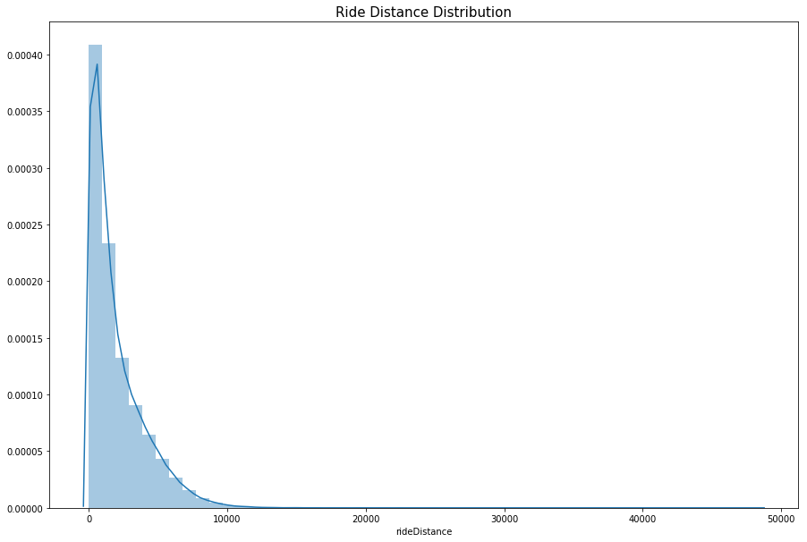
总移动距离统计(步行距离+交通工具距离+游泳距离)
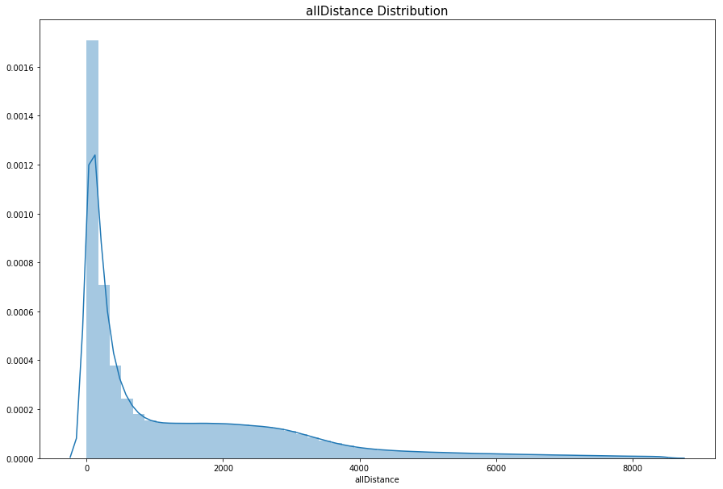
最终排名与总移动距统计
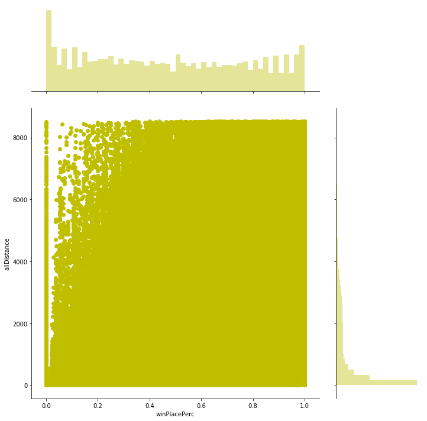

### 4. 比赛模式统计
训练数据中 563279 (12.93%) 单排比赛, 3070150 (70.46%) 双排比赛 723907 (16.61%) 四排比赛.
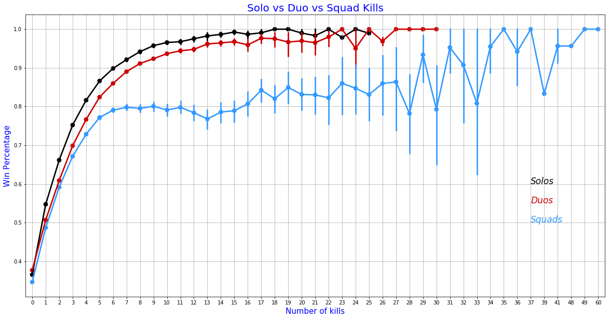

### 5. 相关性分析
原始数据的相关性分析矩阵

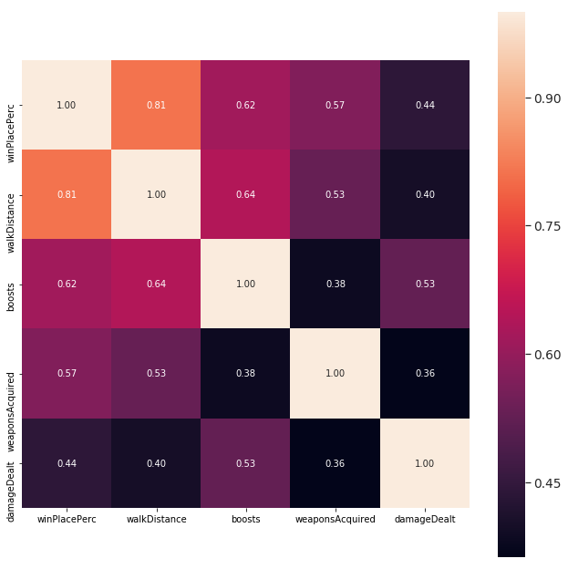

## 2. 特征工程
### 1、组合特征
```
    //总距离
    df['totalDistance'] = (df['rideDistance'] + df["walkDistance"] +df["swimDistance"])
    //短时间杀人率
    df['killStreakrate'] = df['killStreaks'] / df['kills']
    //物品使用数量
    df['healthitems'] = df['heals'] + df['boosts']
    //杀人排名归一化
    df['killPlace_over_maxPlace'] = df['killPlace'] / df['maxPlace']
    //爆头率
    df['headshotKills_over_kills'] = df['headshotKills'] / df['kills']
    //武器获取率
    df['distance_over_weapons'] = df['totalDistance'] / df['weaponsAcquired']
    //步行距离治疗物品
    df['walkDistance_over_heals'] = df['walkDistance'] / df['heals']
    //步行距离杀人数
    df['walkDistance_over_kills'] = df['walkDistance'] / df['kills']
    //步行距离杀人数
    df['killsPerWalkDistance'] = df['kills'] / df['walkDistance']
    //特殊杀人次数
    df["skill"] = df["headshotKills"] + df["roadKills"]
``` 
### 3、rank排名特征
```
    //统计每场比赛每个队的各个features的均值
    agg = df.groupby(['matchId', 'groupId'])[
        features].agg('mean')
    agg_rank = agg.groupby('matchId')[features].rank(
        pct=True).reset_index()
    agg_mean = agg.reset_index().groupby(
        'matchId')[features].mean()
    agg_mean.columns = [x + "_mean_mean" for x in agg_mean.columns]
    //添加到数据中
    df_out = df_out.merge(
        agg.reset_index(), how='left', on=['matchId', 'groupId'])
    //计算均值在这场比赛的排名值
    df_out = df_out.merge(
        agg_rank, suffixes=["_mean", "_mean_rank"], how='left', on=['matchId', 'groupId'])
    df_out = df_out.merge(
        agg_mean.reset_index(), how='left', on=['matchId'])
    df_out = reduce_mem_usage(df_out)
    //统计每场比赛每个队的各个features的均最大值
    agg = df.groupby(['matchId', 'groupId'])[features].agg('max')
    agg_rank = agg.groupby('matchId')[features].rank(
        pct=True).reset_index()
    agg_mean = agg.groupby('matchId')[features].mean()
    agg_mean.columns = [x + "_max_mean" for x in agg_mean.columns]
    //添加到数据中
    df_out = df_out.merge(
        agg.reset_index(), how='left', on=['matchId', 'groupId'])
    //计算最大值在这场比赛的排名值
    df_out = df_out.merge(agg_rank, suffixes=[
        "_max", "_max_rank"], how='left', on=['matchId', 'groupId'])
    df_out = df_out.merge(
        agg_mean.reset_index(), how='left', on=['matchId'])
    df_out = reduce_mem_usage(df_out)
    //统计每场比赛每个队的各个features的均最小值
    agg = df.groupby(['matchId', 'groupId'])[features].agg('min')
    agg_rank = agg.groupby('matchId')[features].rank(
        pct=True).reset_index()
    print("Merging (min):")
    df_out = df_out.merge(agg.reset_index(), how='left', on=[
        'matchId', 'groupId'])
    //计算最小值在这场比赛的排名值
    df_out = df_out.merge(agg_rank, suffixes=[
        "_min", "_min_rank"], how='left', on=['matchId', 'groupId'])
    df_out = reduce_mem_usage(df_out)

```
## 3. 模型训练
- DNN模型
- XGBOOST模型
- LightGBM模型
### 1. DNN模型
使用tensorflow构建DNN模型
```
activation_fun = functools.partial(tf.nn.leaky_relu, alpha=0.1)
initializer = layers.variance_scaling_initializer()
kernel_regularizer = None
net = tf.layers.dense(inputs, units=128, activation=activation_fun, kernel_initializer=initializer, kernel_regularizer=kernel_regularizer)
conn = net
net = tf.layers.dense(net, units=64, activation=activation_fun, kernel_initializer=initializer, kernel_regularizer=kernel_regularizer)
net = tf.layers.dense(net, units=64, activation=activation_fun, kernel_initializer=initializer, kernel_regularizer=kernel_regularizer)
net = tf.layers.dense(net, units=128, activation=activation_fun, kernel_initializer=initializer, kernel_regularizer=kernel_regularizer)
net = tf.add(conn, net)
net = tf.layers.dense(net, units=128, activation=activation_fun, kernel_initializer=initializer,kernel_regularizer=kernel_regularizer)
net = tf.layers.dense(net, units=1, activation=None, kernel_initializer=initializer, kernel_regularizer=tf.contrib.layers.l2_regularizer(0.0000001))
```
训练曲线
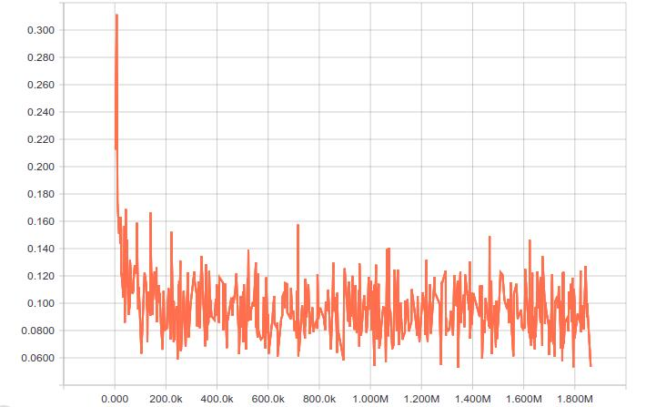
验证曲线
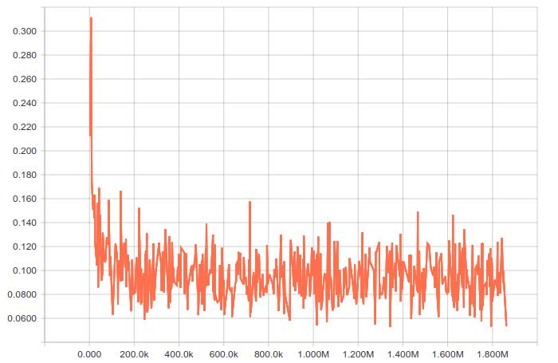

### 2. XGBOOST模型
```
param = {
    "max_depth": 6,
    "learning_rate": 0.05,
    "n_estimators": 1,
    "subsample": 0.8,
    "colsample_bytree": 0.8,
    "min_child_weight": 0.75,
    'objective': 'binary:logistic',
    "gamma": 0,
    "reg_lambda": 0,
    "reg_alpha": 1
}
```
### 3. LightGBM模型
```
params = {
        'task': 'train',
        'boosting_type': 'gbdt',
        'objective': 'regression',
        'metric': {'mean_absolute_error'},
        'num_leaves': 63,
        'max_depth': -1,
        'learning_rate': 0.05,
        'feature_fraction': 0.88,
        'bagging_fraction': 0.9,
        'bagging_freq': 15,
        'device': 'gpu',
        'verbose': 1,
    }
```

## 4. 模型融合
使用stacking融合训练好的三个模型，stacking 就是当用初始训练数据学习出若干个基学习器后，将这几个学习器的预测结果作为新的训练集，来学习一个新的学习器。
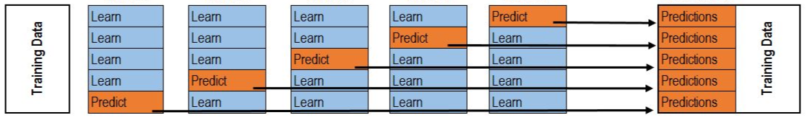
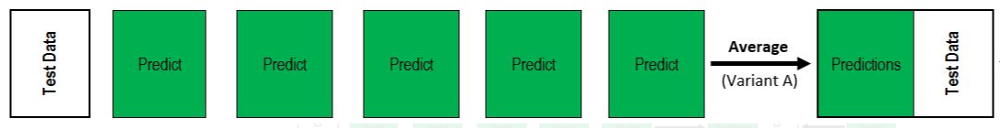

## 5.输出结果调整
由于玩家的排名（winPlacePerc）基于在被淘汰时还有多少其他团队（groupid）还活着。假设一场比赛的团队数为N,则输出值为[0, 1/(N-1), 2/(N-1), … , (N-2)/(N-1), 1]。最终的预测结果按大小排序后取匹配值。

<br>
例： 一场比赛中共有10个队，则输出值应该在[0, 0.11111111, 0.22222222, 0.33333333, 0.44444444,0.55555556, 0.66666667, 0.77777778, 0.88888889, 1]。

## 6. 第一名思路
### 1.Killplace中包含了最终排名winPlacePerc的信息（例：0杀的人按killPlace排名与按winPlace排名的结果相同）。
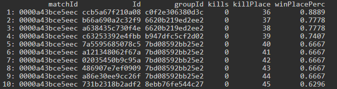

- 假设一场比赛中有 A: 1st, B: 2nd, C: 3rd, D: 4th, E: 5th, F: 6th
```
Player 1: Group A, 1 kill, #4 killPlace
Player 2: Group A, 3 kills, #2 killPlace
Player 3: Group B, 4 kills, #1 killPlace
Player 4: Group C, 1 kill, #5 killPlace
Player 5: Group C, 0 kills, #7 killPlace
Player 6: Group D: 0 kills, #8 killPlace
Player 7: Group E, 2 kills, #3 killPlace
Player 8: Group E, 1 kill, #6 killPlace
Player 9: Group E, 0 kills, #9 killPlace
Player 10: Group F, 0 kills, #10 killPlace
```
- 通过这些信息可以画出关系图如下：
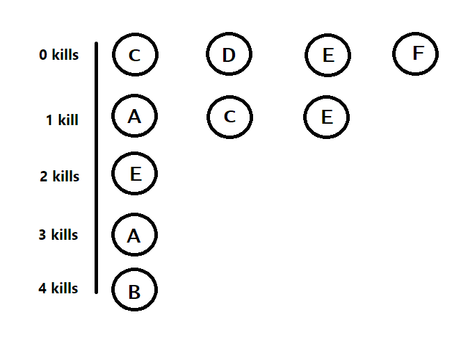
- 通过0kill的信息可以得出C>D>E>F;
- 通过1kill的信息可以得出A>C>E;
- 现在我们知道A>C>D>E>F，所以现在唯一未知的是B

### 2. 使用Xgb regression模型预测未知group的位子
- 如果预测值A = 0.9 B=0.85 C=0.6 则 A>B>C>D>E>F

### 3. 填补空缺值
- 在比赛数据中会经常出现缺失值（maxPlace > numGroups）
- 假设缺失值为均匀分布然后在缺失的位子填入假数据（例： numGroup = 20 maxPlace = 24, 那么假数据的位子为4， 8， 12）
